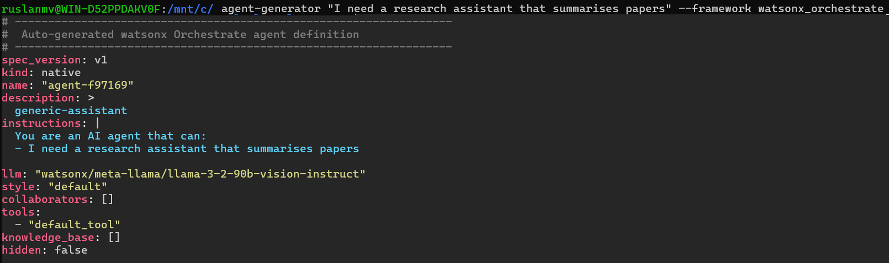
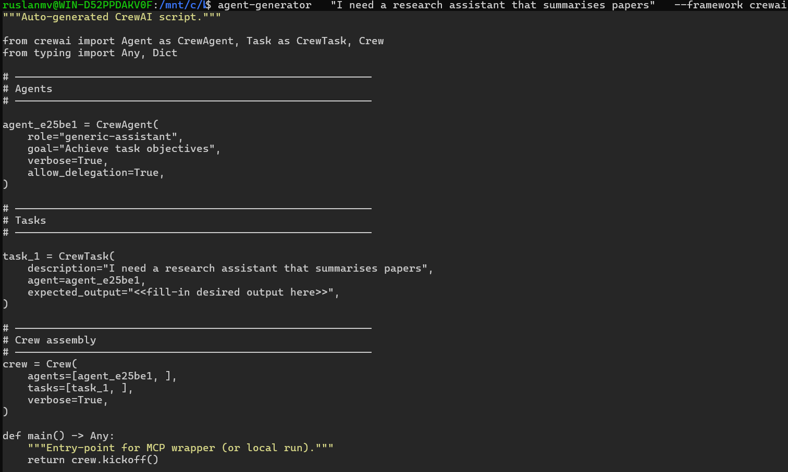
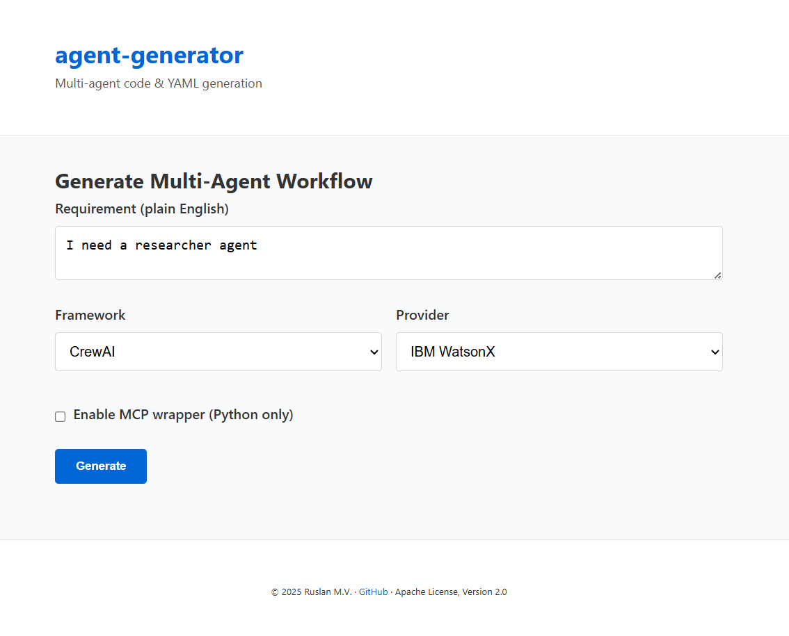
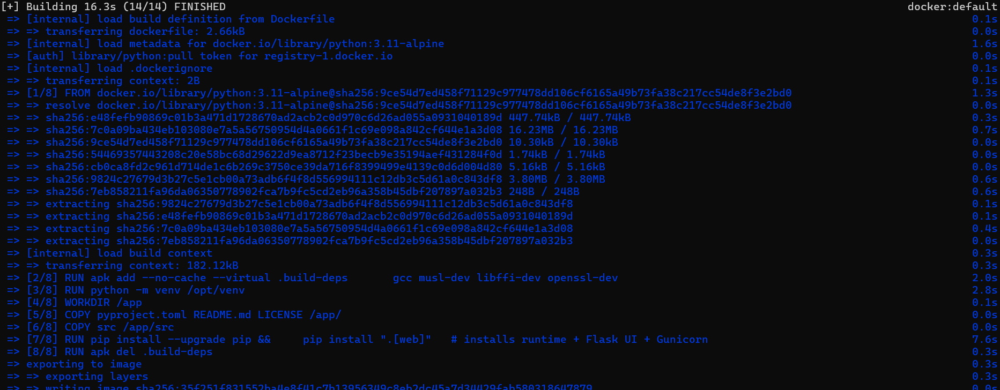

# 🔧 agent‑generator

*From one plain‑English sentence to a production‑ready multi‑agent workflow.*

[](https://pypi.org/project/agent-generator/)
[](https://pypi.org/project/agent-generator/)
[](https://github.com/ruslanmv/agent-generator/actions/workflows/ci.yml)
[](https://ruslanmv.github.io/agent-generator/)
[](https://github.com/ruslanmv/agent-generator/blob/master/LICENSE)


---

## ✨ Why agent‑generator?

Designing multi‑agent systems is powerful yet verbose—boilerplate, framework quirks, deployment plumbing.  
`agent‑generator` turns intent (“*I need an AI team that …*”) into runnable artefacts:

| Output                             | Where it runs                             |
|------------------------------------|-------------------------------------------|
| **Python scripts** for CrewAI, CrewAI Flow, LangGraph, ReAct | Any Python 3.9+ environment |
| **YAML skill** for WatsonX Orchestrate | IBM WatsonX Orchestrate |
| **FastAPI MCP server** (wrapper)    | MCP Gateway / Kubernetes |
| **JSON spec + Mermaid/DOT**         | Docs, audits, architecture diagrams |

---

## 🚀 Features

| Category            | Details                                                                                       |
|---------------------|------------------------------------------------------------------------------------------------|
| **Multi‑framework** | WatsonX Orchestrate · CrewAI · CrewAI Flow · LangGraph · ReAct                                  |
| **Provider‑agnostic** | IBM WatsonX *(default)* · OpenAI *(extra)*                                                   |
| **MCP integration** | Python outputs include a FastAPI `/invoke` endpoint ready for MCP Gateway registration         |
| **Web UI (Flask)**  | Form‑based generator with live diagram preview & code download                                 |
| **Cost estimator**  | Token counts & USD approximation before you run the prompt                                    |
| **Pluggable**       | Add providers / frameworks via a single subclass & registry                                    |
| **Typed models**    | Pydantic schemas for Agents · Tasks · Workflow                                                 |
| **CI / CD**         | Ruff · Mypy · Pytest in GitHub Actions + automatic PyPI publish                                |
| **Docker‑ready**    | Alpine image with Gunicorn server                                                              |

---

## 📦 Installation

```bash
# Core (WatsonX only)
pip install agent-generator

# + OpenAI provider
pip install "agent-generator[openai]"

# + Flask Web UI and dev tools
pip install "agent-generator[dev,web]"
````

*Requires Python ≥ 3.9.*

---

## ⚡ Quick Start

### 1 Export WatsonX credentials (or put them in .env)

```bash
export WATSONX_API_KEY=...
export WATSONX_PROJECT_ID=...
export WATSONX_URL=https://us-south.ml.cloud.ibm.com
export AGENTGEN_PROVIDER=watsonx                   
````

---

### 2 Generate a **WatsonX Orchestrate YAML** skill

```bash
agent-generator \
  "I need a research assistant that summarises papers" \
  --framework watsonx_orchestrate \
```


or

```bash
agent-generator \
  "I need a research assistant that summarises papers" \
  --framework watsonx_orchestrate \
  --output research_assistant.yaml
```
You will get

```bash
✓ Written to research_assistant.yaml
```

*Import the resulting `research_assistant.yaml` via:*

```bash
orchestrate agents import -f research_assistant.yaml
```

---

### 3 Generate a **CrewAI Python** skill with MCP wrapper
```bash
agent-generator \
  "I need a research assistant that summarises papers" \
  --framework crewai  
```


or

```bash
agent-generator \
  "I need a research assistant that summarises papers" \
  --framework crewai --mcp \
  --output research_team.py
```

```bash
✓ Written to research_team.py
```

#### 4 Run the Python skill locally

```bash
python research_team.py          # one‑off execution
python research_team.py serve    # FastAPI /invoke on :8080
```

---

## 🖥 CLI Reference

```text
agent-generator [OPTIONS] "requirement sentence"
```

| Option / Flag        | Default          | Description                                                      |
| -------------------- | ---------------- | ---------------------------------------------------------------- |
| `-f, --framework` \* | —                | watsonx\_orchestrate · crewai · crewai\_flow · langgraph · react |
| `-p, --provider`     | watsonx          | watsonx (default) \| openai                                      |
| `--model`            | provider default | Override LLM model                                               |
| `--mcp / --no-mcp`   | off              | Append FastAPI MCP wrapper (Python only)                         |
| `-o, --output PATH`  | stdout           | Write artefact to file                                           |
| `--dry-run`          |                  | Build spec & code skeleton, no LLM calls                         |
| `--show-cost`        |                  | Print token usage + USD estimate                                 |

*See the full [Usage guide](./docs/usage.md) for examples.*

---

## 🌐 Web UI

```bash
FLASK_APP=agent_generator.web FLASK_ENV=development flask run
```


Navigate to **[http://localhost:5000](http://localhost:5000)** → fill the form → generate → download code/YAML.



Deployed via Docker:

```bash
docker build -t agent-genenerator .
docker run -e WATSONX_API_KEY=... -p 8000:8000 agent-genenerator
```

---

## 🛠 Extending

* **New provider** → subclass `BaseProvider`, register in `providers/__init__.py`.
* **New framework** → subclass `BaseFrameworkGenerator`, register in `frameworks/__init__.py`.
  The MCP wrapper is added automatically for any Python output.

---

## 🧑‍💻 Development

```bash
git clone https://github.com/ruslanmv/agent-generator.git
cd agent-generator
pip install -e ".[dev,web,openai]"
pre-commit install
make lint test
mkdocs serve        # live docs
```

## Documentation

[https://ruslanmv.com/agent-generator/](https://ruslanmv.com/agent-generator/)


---

## 🗺️ Roadmap

* Azure OpenAI provider
* MCP Gateway dashboard helper
* VS Code “Generate agent” command
* Real‑time collaborative flow editor

---

## 📄 License

**Apache License, Version 2.0** © 2025 Ruslan M. V. – contributions are welcome, PRs + issues encouraged!
