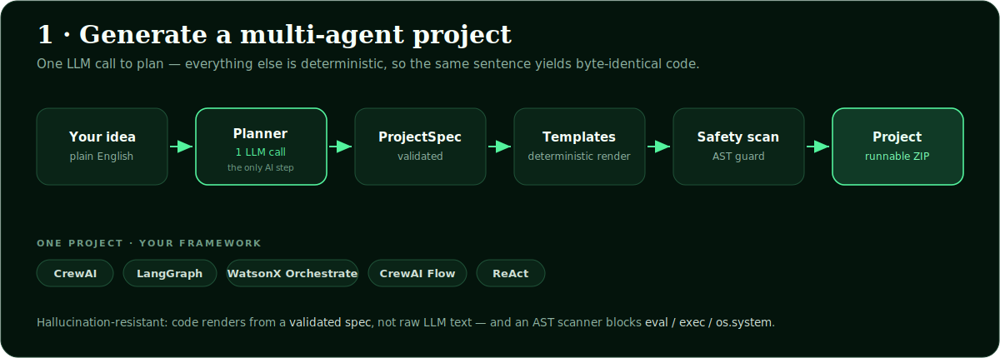
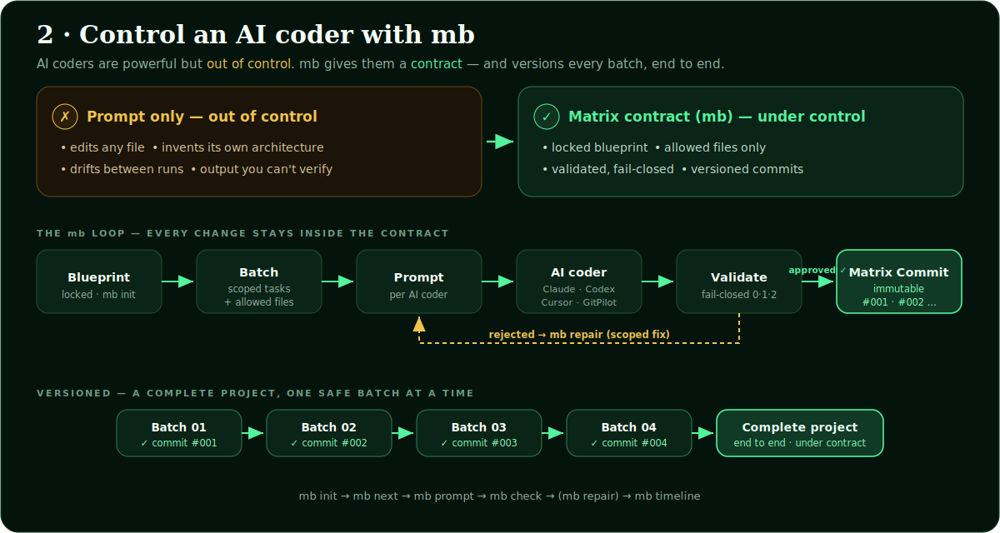

<p align="left">
  
</p>

# agent-generator

**Describe an AI system in one sentence — get a controlled, validated, production-ready project.**

A deterministic generation engine with two jobs: scaffold runnable **multi-agent projects**
(CrewAI · LangGraph · WatsonX Orchestrate · CrewAI Flow · ReAct), and power **Matrix Builder** —
*give AI coders a contract, not a prompt.*

[](https://pypi.org/project/agent-generator/)
[](https://pypi.org/project/agent-generator/)
[](https://github.com/ruslanmv/agent-generator/actions/workflows/ci.yml)
[](LICENSE)
[](https://github.com/agent-matrix/matrix-definitions)
[](https://huggingface.co/spaces/ruslanmv/agent-generator)
[](https://github.com/agent-matrix/matrix-hub)

---

## Why agent-generator

One package, two engines that share a deterministic core (one LLM call to plan, everything else
template-rendered, so the same input yields byte-identical output):

| | What it does | Entry point |
|---|---|---|
| **Project generator** | Turn a sentence into a runnable multi-agent project for your framework of choice. | `agent-generator "<idea>" -f crewai` |
| **Matrix Builder engine** | Turn an idea into a *controlled bundle* (blueprint + locked standards + tasks + per-coder prompts), then **validate** what an AI coder produced against that contract. | `AgentGenerator` SDK · `mb` CLI · HTTP API |

The Matrix engine is the deterministic core behind **[Matrix Builder](https://build.matrixhub.io)**.
It enforces the signed **[Ruslan Magana Definitions](docs/matrix-engine/ruslan-magana-definitions.md)**,
works with **Claude Code, Codex, Cursor, GitPilot, IBM Bob** (and any AI coder), and publishes
validated, signed bundles to **MatrixHub**.

---

## How it works

**1 · Generate a multi-agent project** — one LLM call plans; everything else is deterministic
template rendering, so the same sentence yields byte-identical, safety-scanned code.

<p align="center"></p>

**2 · Control an AI coder with `mb`** — AI coders are powerful but *out of control*: left to a raw
prompt they edit any file, invent their own architecture, drift between runs, and produce output you
can't verify. **That is why Matrix Builder exists.** `mb` gives the AI coder a *contract* — a locked
blueprint, scoped batches, allowed-file boundaries, and fail-closed validation — and records every
accepted change as an **immutable, versioned Matrix Commit**. Batches stack into a complete project,
end to end, fully under contract.

<p align="center"></p>

---

## Install

```bash
pip install agent-generator            # the CLI + the engine + the mb CLI
pip install "agent-generator[openai]"  # + OpenAI provider
pip install "agent-generator[all]"     # + all providers and frameworks
```

Python 3.10+. No credentials or network are needed for controlled generation and validation —
the engine is deterministic.

---

## Quick start

### A · Generate a multi-agent project

```bash
# pick a provider (WatsonX is the default; OpenAI shown here)
export OPENAI_API_KEY=sk-...; export AGENTGEN_PROVIDER=openai

agent-generator "Research team that finds papers and writes summaries" -f crewai -o team/
cd team && crewai run

# no credentials? generate deterministically with --dry-run
agent-generator "Hello world agent" -f crewai --dry-run
```

### B · Control an AI coder (the Matrix engine)

```python
from agent_generator import AgentGenerator
from agent_generator.contracts import IdeaRequest

engine = AgentGenerator()                                   # deterministic, no credentials
idea   = IdeaRequest(idea="An AI app that analyzes GitHub repositories")

candidates = engine.generate_blueprint_candidates(idea)     # 3 quality-tiered options
blueprint  = engine.generate_controlled_blueprint(idea)     # the locked contract
engine.export_zip(blueprint, "dist/app.zip", release_evidence=True)   # signed bundle

# after your AI coder runs, validate its output against the contract:
report = engine.validate_ai_coder_patch("b1", repo_path="dist/out", blueprint=blueprint)
print(report.status)         # approved | needs-repair | rejected
print(report.repair_prompt)  # bounded fix instructions when not approved
```

Or from the CLI / HTTP:

```bash
agent-generator matrix candidates --idea "An AI app that analyzes GitHub repositories"
agent-generator matrix export     --idea "..." --out dist/app.zip --release-evidence
agent-generator matrix validate   --idea "..." --repo dist/app        # exit 0/1/2

uvicorn agent_generator.http.app:app   # OpenAPI at /openapi.json, routes under /api/v1
```

---

## The `mb` CLI — local-first

`mb` is the **local-first Matrix Builder**: the full *git-for-AI* loop on your machine — offline,
deterministic, zero infrastructure. State lives in a `.mb/` folder that mirrors the server model.

```bash
mb init "A GitHub repo intelligence agent" --quality standard   # idea → controlled blueprint
mb next "Add repo ingestion"                                    # plan a scoped batch
mb prompt --coder claude-code                                   # contract-bound prompt (+ CLAUDE.md)
mb check backend/app/...                                        # validate → an immutable Matrix Commit
mb timeline                                                     # the build history
mb repair                                                       # scoped fix prompt from the last failure
mb login && mb sync                                             # push/pull to the cloud (optional)
mb mcp                                                          # expose the build loop as MCP tools
```

`mb check` is **fail-closed** (exit `0` approved · `1` needs-repair · `2` rejected). A passing check
creates an immutable **Matrix Commit** carrying the prompt snapshot, standards lock, file manifest,
diff, and validation result. Full guide: **[docs/matrix-engine/mb-cli.md](docs/matrix-engine/mb-cli.md)**.

---

## Why it is safe to ship

| Concern | How it is handled |
|---|---|
| **Hallucinated code** | Output is rendered from a validated `ProjectSpec` / locked blueprint, not from raw LLM text. |
| **Drift between runs** | One LLM call to plan; the rest is deterministic — same input → byte-identical output. |
| **Unsafe patterns** | AST scanner blocks `eval`, `exec`, `os.system`, and bare `subprocess`. |
| **Uncontrolled AI edits** | The contract pins allowed files; forbidden edits are **rejected** (RMD), with a bounded repair prompt. |
| **Standards drift** | Rules load from the signed `matrix-definitions` pack and are pinned in `MATRIX_STANDARDS.lock`. |
| **Provenance** | Release bundles ship checksums, a CycloneDX SBOM, and a cosign/attestation bundle. |
| **Secrets** | Only `.env.example` is generated; real secrets live in the platform vault. |

---

## Frameworks & built-in tools

| Framework | What you get |
|---|---|
| **CrewAI** | `crew.py` + `agents.yaml` + `tasks.yaml` + tools + tests |
| **LangGraph** | `graph.py` with a typed `StateGraph` |
| **WatsonX Orchestrate** | `agent.yaml` ready for `orchestrate agents import` |
| **CrewAI Flow** | Flow class with `@start` / `@listen` |
| **ReAct** | Reasoning loop with a tool registry |

Built-in tools available to generated agents: `web_search`, `pdf_reader`, `http_client`,
`sql_query`, `file_writer`, `vector_search`. Runs on **WatsonX** by default, **OpenAI** with one
flag, or local models via **Ollama / OllaBridge**.

Key CLI flags: `-f <framework>` · `-o <path>` · `--dry-run` (no LLM) · `-p openai` ·
`--show-cost` · `--mcp`.

---

## The platform (web · desktop · mobile)

The same engine ships as a full product — a FastAPI backend, a Vite SPA, Tauri desktop installers,
and a Capacitor Android app, from one TypeScript codebase.

```bash
make install      # CLI + backend (FastAPI) + frontend (Vite SPA)
make start        # backend :8000 + SPA :5173  (Ctrl-C stops both)
make build        # SPA bundle + backend Docker image + desktop installer for this host
```

Open <http://localhost:5173>. Signed CI builds (Authenticode, Apple notarization, GPG, Play Store)
live in `.github/workflows/`; the Kubernetes deployment is in [`deploy/helm/`](deploy/helm). A quick
visual wizard is also available standalone: `uvicorn agent_generator.wsgi:app --port 8000`.

---

## Architecture & ecosystem

```
matrix-builder      orchestration + UX (the public product)
agent-generator     generation + validation        ← this repo (the engine)
matrix-definitions  signed rules / standards (RMD)
MatrixHub           registry for trusted artifacts
```

- **Engine API** is versioned (`ENGINE_API_VERSION`) and contracts are versioned
  (`CONTRACTS_VERSION`); the SDK method surface is guarded by parity tests.
- Package **`0.2.0`** satisfies the `matrix-definitions` compatibility gate
  (`compatibility.agent_generator >= 0.2.0`) — it can load and verify a signed standards pack.

See [docs/matrix-engine/compatibility-matrix.md](docs/matrix-engine/compatibility-matrix.md).

---

## Security & supply chain

- **Determinism** — generation/validation need no network or credentials; identical input → identical output.
- **Signed standards** — rules come from the signed `matrix-definitions` pack, checksum-verified at load.
- **Release evidence** — `--release-evidence` bundles ship `checksums.txt`, a CycloneDX **SBOM**, and a **cosign** bundle.
- **Pinned CI** — GitHub Actions pinned to SHAs, least-privilege tokens, CODEOWNERS on workflows/release.

Verify a bundle:

```bash
cd dist/out && sha256sum -c artifacts/checksums.txt
```

---

## Documentation

Full docs (MkDocs) live in [`docs/`](docs). Highlights:

- **Get started** — [Install](docs/installation.md) · [Usage](docs/usage.md) · [Pick a framework](docs/frameworks.md)
- **Matrix engine** — [Quickstart](docs/matrix-engine/quickstart.md) · [`mb` CLI](docs/matrix-engine/mb-cli.md) · [Public engine API](docs/matrix-engine/public-engine-api.md) · [HTTP API](docs/matrix-engine/http-api.md) · [Validation & repair](docs/matrix-engine/validation-and-repair.md) · [Ruslan Magana Definitions](docs/matrix-engine/ruslan-magana-definitions.md)
- **Operations** — [Platform](docs/platform.md) · [Production readiness](docs/production-readiness.md) · [Release process](docs/release-process.md)

Build the docs site locally: `mkdocs serve`.

---

## Contributing

```bash
git clone https://github.com/ruslanmv/agent-generator.git && cd agent-generator
make install      # CLI + backend + frontend
make test         # CLI pytest + backend pytest + frontend type-check & build
make lint         # ruff + black + isort
```

| Target | What it does |
|---|---|
| `make install` | Editable CLI install + backend + SPA |
| `make test` | CLI pytest + backend pytest + frontend `tsc` + Vite build |
| `make lint` | ruff + black `--check` + isort `--check` |
| `make start` / `make stop` | Run / stop the dev servers |
| `make build` / `make build-android` | Host installer / Android APK |
| `make help` | Full list of targets |

Issues and pull requests are welcome. Please run `make lint` and `make test` before opening a PR.

---

## License & author

Licensed under **Apache 2.0** — see [LICENSE](LICENSE).

Created and maintained by **[Ruslan Magana Vsevolodovna](https://ruslanmv.com)**, author of the
**Ruslan Magana Definitions** — the signed standard that keeps AI-built software under contract.
