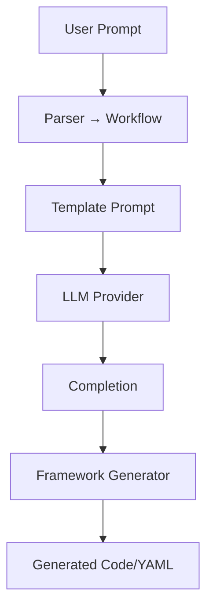

# Architecture of agent-generator

This document describes the overall architecture of **agent-generator**, with a focus on the generative pipeline that transforms plain‑English prompts into fully configured agent code or YAML for various frameworks.


## 1. High‑Level Overview

1. **User Input (CLI or Web UI)**: The user provides a natural‑language requirement, selects a framework, and optionally a provider, model, and other flags.
2. **Env Loader**: `.env` variables are loaded into the process environment.
3. **Pre‑flight Check**: Credentials for the chosen provider (WatsonX or OpenAI) are validated; helpful messages are printed if missing.
4. **Settings Loader**: Pydantic reads `AGENTGEN_` environment variables and `.env` to build a `Settings` object, applying defaults and provider‑specific overrides (e.g., defaulting `gpt-4o` for OpenAI).
5. **Parser**: The natural‑language prompt is parsed into a **Workflow** graph: a set of `Agent`, `Task`, and `Edge` objects that represent the multi‑agent workflow.
6. **Prompt Renderer**: A Jinja template combines the workflow, settings, and framework instructions into a single string prompt for the LLM.
7. **LLM Provider**: The prompt is sent to the selected LLM provider (WatsonX REST API or OpenAI SDK). The raw completion is returned.
8. **Framework Generator**: Another set of Jinja templates consume the `Workflow` and generate code or YAML in the target framework’s syntax, leveraging the LLM response only when needed (e.g., to fill details in templates).
9. **Output**: The generated code/YAML is either printed with syntax highlighting or written to a file. Token‑ and cost‑estimates are optionally shown.


## 2. Component Breakdown

### 2.1 CLI / Web UI

* **`src/agent_generator/cli.py`**: Typer‑based CLI entrypoint for terminal usage.
* **`src/agent_generator/web/`**: Flask application providing a browser UI with forms for prompt, framework, and provider selection.

### 2.2 Configuration & Environment

* **`config.py`**: Defines `Settings` model reading from `AGENTGEN_*` vars. Handles provider defaults, model overrides, and credential checks.
* **`.env` support**: Load dotenv at startup to override environment values locally.

### 2.3 Parser & Workflow Model

* **`utils/parser.py`**: Converts free‑form English into a structured `Workflow`:

  * `Agent` model: `id`, `role`, `tools`, `llm_config`.
  * `Task` model: `id`, `goal`, `inputs`, `outputs`, `agent_id`.
  * `Edge` model (future extension): dependencies between tasks.

### 2.4 Prompt Rendering

* **`utils/prompts.py`**: Jinja templates to render the full LLM prompt, injecting workflow and settings. Although currently not always used for code generation, it standardizes prompt creation.

### 2.5 LLM Providers

* **`providers/watsonx_provider.py`**: Thin wrapper around IBM WatsonX REST API.
* **`providers/openai_provider.py`**: Wraps the OpenAI Python SDK; defaults to `gpt-4o` if no override.
* **`providers/base.py`**: Shared interface (`generate`, `tokenize`, `estimate_cost`).

### 2.6 Framework Generators

Each framework lives in `src/agent_generator/frameworks/<name>/generator.py` and implements:

* **`file_extension`**: `py` or `yaml`.
* **`generate_code(workflow, settings, mcp)`**: Renders Jinja templates (`agent.jinja2`, `task.jinja2`, `main.jinja2`).

Supported frameworks:

* CrewAI (Python SDK)
* CrewAI Flow (event‑driven)
* LangGraph (DAG API)
* ReAct (reason‑act pattern)
* WatsonX Orchestrate (native YAML)

### 2.7 Output & Utilities

* **Syntax highlighting** via Rich when printing.
* **MCP wrapper**: Optional FastAPI server scaffold if `--mcp` is passed.


## 3. Generative Pipeline Detail

### 3.1 Detailed Data Flow



1. **Parser**: Breaks text into structured data.
2. **PromptRender**: Applies Jinja to produce the text sent to the LLM.
3. **LLM**: Returns a completion string with e.g. helper instructions or detailed sub‑prompts.
4. **Generator**: Ignores most LLM output, instead using static templates to turn the `Workflow` graph into code.
5. **Code**: Final output, ready to run or deploy.

#### Why separate prompt vs generator?

* Decouples **what** you ask the LLM (open‑ended natural‑language) from **how** you produce deterministic code templates.
* Future architectures can inject LLM responses deeper into code gen templates.


## 4. Extensibility & Customization

* **Adding a Provider**: Create `providers/my_provider.py` implementing `BaseProvider`, register in `PROVIDERS` in `providers/__init__.py`.
* **Adding a Framework**: Create `frameworks/my_framework/generator.py`, add templates under that folder, register in `FRAMEWORKS` in `frameworks/__init__.py`.
* **Custom Prompts**: Modify or add Jinja templates in `utils/prompts.py`.
* **Parser tweaks**: Improve `utils/parser.py` to extract richer workflows (e.g. data schemas, error handling agents).


## 5. File Locations

```
src/agent_generator/
├── cli.py
├── config.py
├── frameworks/
│   └── <framework>/generator.py
├── providers/
│   └── *_provider.py
└── utils/
    ├── parser.py
    └── prompts.py
```


Jump in: **[Installation ➜](installation.md)** · **[Usage ➜](usage.md)** · **[Frameworks ➜](frameworks.md)**

