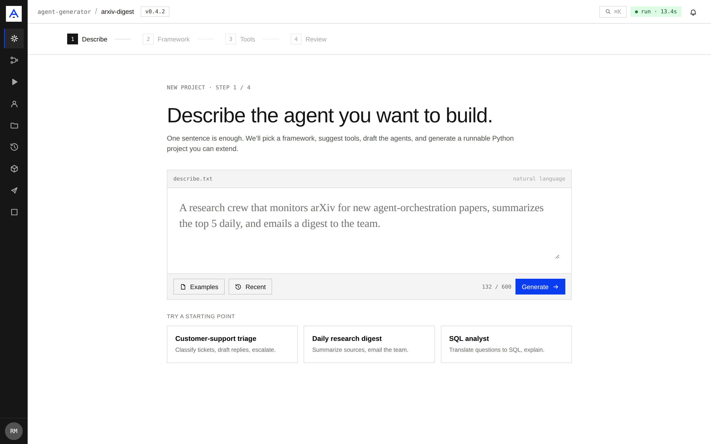
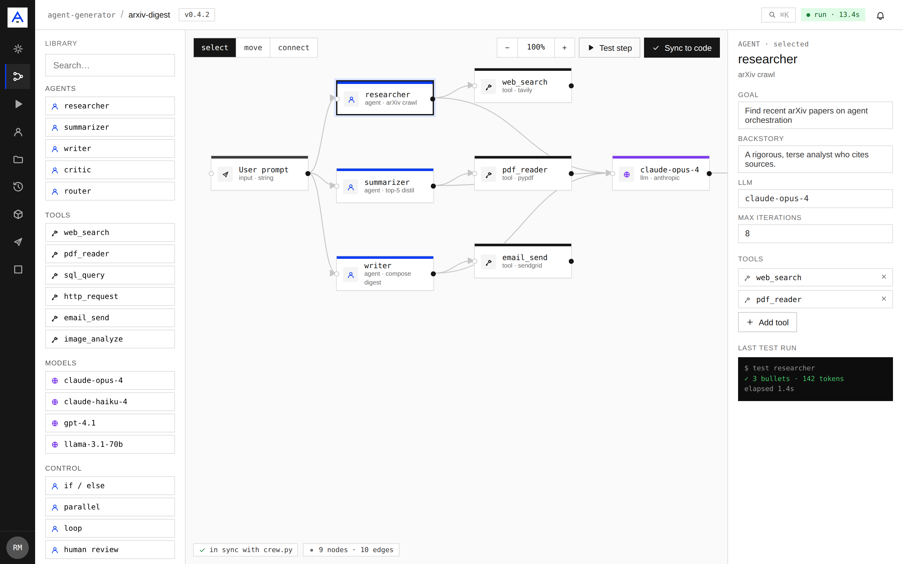
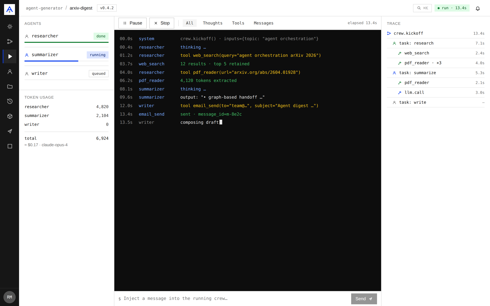
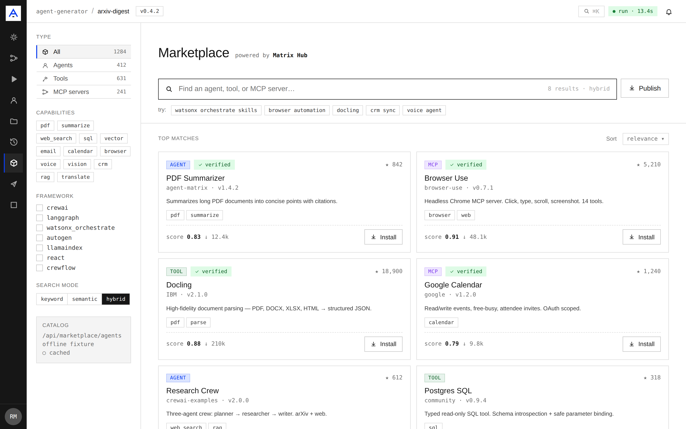
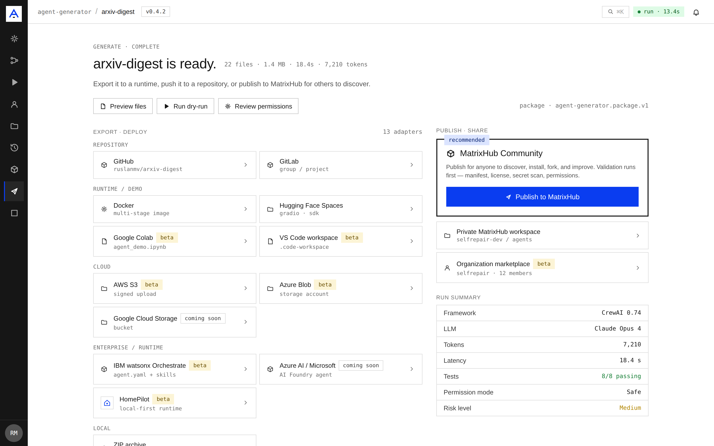
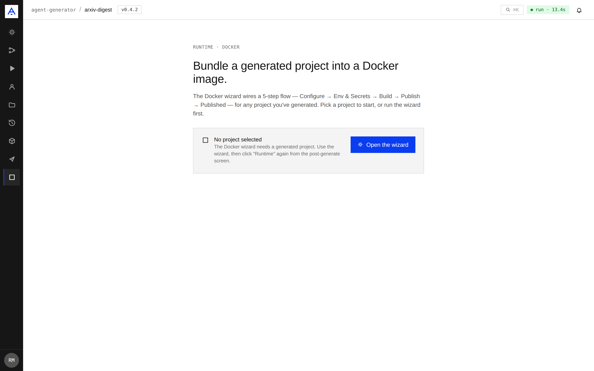
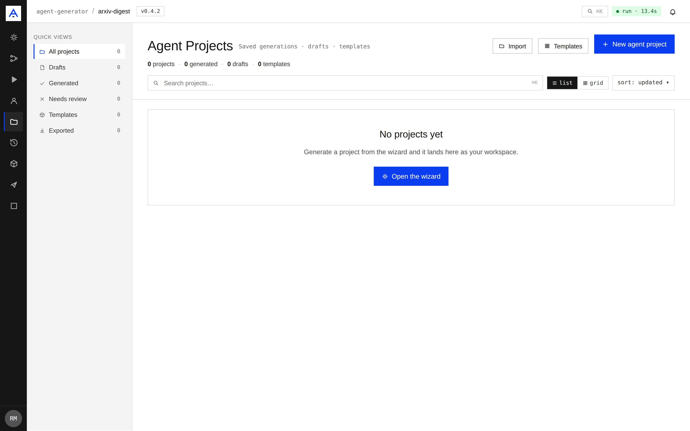
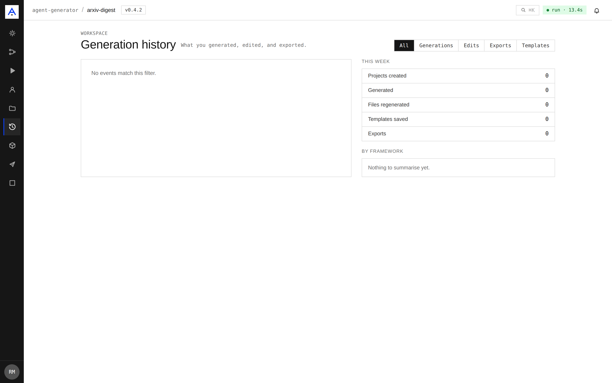
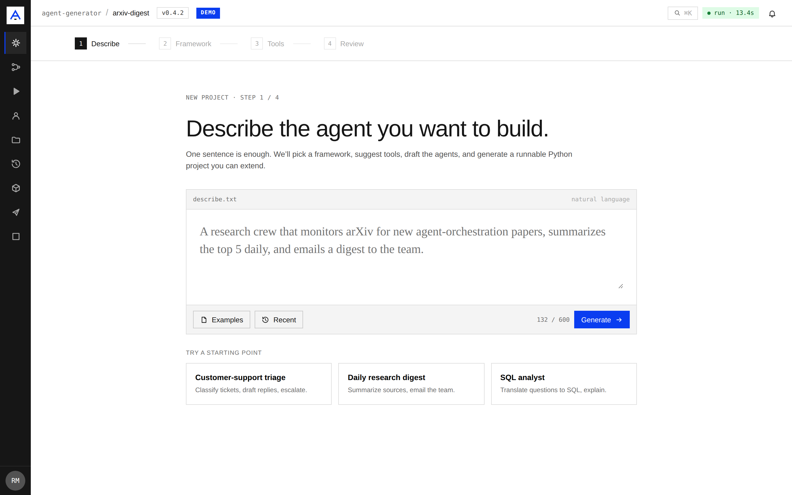

# agent-generator — Web Workspace Guide

The web workspace is a React (Vite) single-page app that drives the same engine as the
CLI: describe an agent in plain English, pick a framework and model, generate a runnable
project, watch it run, and publish it. Every screen reads from the real backend
(`/api/*`) and **fails open** to bundled data so the public demo never breaks.

- **Live demo:** <https://huggingface.co/spaces/ruslanmv/agent-generator>
- **Source:** `frontend/` (React 18 · react-router · Vite)

---

## Run it locally

```bash
cd frontend
npm install

# Dev server (hot reload) — serves every client route
npm run dev            # → http://127.0.0.1:5173

# …or a production build + preview
AG_BUILD_CHANNEL=web npm run build
npm run preview        # → http://127.0.0.1:4173
```

Point it at a backend with `VITE_API_URL` (defaults to same-origin):

```bash
VITE_API_URL=http://127.0.0.1:8000 npm run dev
```

With no backend reachable the app still renders — facets, catalogues, and history come
from local fallbacks until the API answers.

---

## A tour of the workspace

### Generate — describe, then build

One sentence is enough. The wizard suggests a framework, drafts the agents and tools, and
generates a runnable Python project you can extend. Starting points seed common patterns
(support triage, research digest, SQL analyst).



### Pipeline — the project as a graph

The generated project is rendered as a live node graph (library · canvas · inspector). The
graph is **derived from the real project spec** — agents, tools, the model, and the
input/output terminals — not a static mock. Select a node to edit its goal, backstory,
model, and tools.



### Run — live agent console

Three live surfaces stream a run: the agent sidebar (status + token usage), the streaming
event console, and the trace tree. When a run id is present these stream real agent
activity over the run WebSocket; otherwise a representative sample is shown.



### Marketplace — Matrix Hub catalogue

Browse and install agents, tools, and MCP servers. The list is loaded live from
`/api/marketplace/agents`; the catalog status pill (bottom-left) shows whether it is the
**live catalogue** or the **offline fixture** fallback.



### Export & Publish — ship the project

Export to a runtime adapter, push to a repository, or publish to Matrix Hub. Publishing
posts to the real marketplace endpoint.



### Docker — containerize in five steps

Configure → Env/Secrets → Build → Publish → Published. Secrets are written through
`/api/projects/{id}/secrets` and the build step streams real `docker buildx` logs over a
WebSocket.



### Projects & History

The Projects hub lists real projects from `/api/projects`; History shows past runs.




---

## Demo vs. real backend (runtime capability check)

The app does **not** hard-code "demo mode" from the build channel. On boot it probes the
backend (`GET /api/auth/me`): the public demo stamps every response with
`x-agent-generator-channel: hf-space` (and has no auth route), so the app marks itself as a
demo and shows a **DEMO** badge; against a real backend the badge and demo banners never
appear and every route is fully wired.

| Real backend (no badge) | Demo backend (`hf-space` → DEMO badge) |
|---|---|
|  |  |

Look at the top bar next to the version: the right image shows the blue **DEMO** badge that
only renders when the backend reports the demo channel.

---

## Regenerating these screenshots

The screenshots are captured with Playwright against a local preview build. The capture
script also asserts the de-demo behaviour (no DEMO badge normally; badge appears when the
backend reports `hf-space`).

```bash
cd frontend
python -m pip install playwright && python -m playwright install chromium

AG_BUILD_CHANNEL=web npm run build
npm run preview -- --port 4173 --host 127.0.0.1 &

python shoot.py --base-url http://127.0.0.1:4173 --out ../docs/assets/screenshots

# Playwright is only needed for capture — uninstall when done
python -m pip uninstall -y playwright
```
