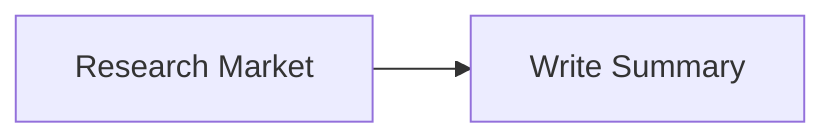

# agent‑generator 🛠️🤖

*A one‑line prompt … a fully configured multi‑agent team.*


`agent‑generator` converts plain‑English requirements into runnable code for:

* **CrewAI** & **CrewAI Flow**
* **LangGraph**
* **ReAct**
* **WatsonX Orchestrate** (YAML)

Highlights:

| Feature                | ✓ |
|------------------------|---|
| IBM WatsonX *default*  | ✅ |
| Plug‑in providers      | ✅ |
| MCP server wrapper     | ✅ |
| Rich CLI + Flask UI    | ✅ |
| Mermaid / DOT diagrams | ✅ |

<div class="admonition tip">
<strong>Quick install</strong>

```bash
pip install agent-generator
````

</div>

Jump in: **[Installation ➜](installation.md)** · **[Usage ➜](usage.md)** · **[Frameworks ➜](frameworks.md)**

````

---

### `docs/installation.md`
```markdown
# Installation

## Core (WatsonX only)

```bash
pip install agent-generator
````

## Extras

| Extra tag | Installs                     | Purpose           |
| --------- | ---------------------------- | ----------------- |
| `openai`  | `openai` SDK                 | Use GPT models    |
| `web`     | `flask`, `gunicorn`          | Run the visual UI |
| `dev`     | `pytest`, `ruff`, `mkdocs` … | Contribute / test |

```bash
# Core + web UI
pip install "agent-generator[web]"

# Everything
pip install "agent-generator[dev,web,openai]"
```

## Environment

Create `.env` (or export directly):

```bash
# WatsonX (default)
export WATSONX_API_KEY="..."
export WATSONX_PROJECT_ID="..."
export WATSONX_URL="https://us-south.ml.cloud.ibm.com"

# Optional OpenAI
export OPENAI_API_KEY="sk-..."
```

> The CLI will error early if the chosen provider credentials are missing.

````

---

### `docs/usage.md`
```markdown
# Usage

## CLI

```bash
agent-generator "I need a research assistant" \
  --framework crewai \
  --output research_team.py --mcp
````

### Common flags

| Flag               | Meaning                                                          |
| ------------------ | ---------------------------------------------------------------- |
| `-f / --framework` | crewai · crewai\_flow · langgraph · react · watsonx\_orchestrate |
| `-p / --provider`  | watsonx *(default)* · openai                                     |
| `--mcp`            | Append FastAPI wrapper to Python files                           |
| `--dry-run`        | Don’t call the LLM – scaffold only                               |
| `--show-cost`      | Print token & USD estimate                                       |

---

## Web UI

```bash
FLASK_APP=agent_generator.web FLASK_ENV=development flask run
```

* Fill prompt → pick framework → **Generate**
* Download code / YAML or copy to clipboard
* Mermaid diagram auto‑renders below the form


---

## Docker

```bash
docker build -t agentgen .
docker run -e WATSONX_API_KEY=... -p 8000:8000 agentgen
# UI now at http://localhost:8000
```

````

---

### `docs/frameworks.md`
```markdown
# Framework comparison

This page shows what the same 2‑task workflow looks like across all supported targets.

> **Scenario**  
> *Agent A* researches market data → *Agent B* writes a summary.

---

## CrewAI

```python
from crewai import Agent as CrewAgent, Task as CrewTask, Crew

agent_a = CrewAgent(role="researcher", goal="Gather data")
agent_b = CrewAgent(role="writer", goal="Summarise findings")

t1 = CrewTask(description="Research the market", agent=agent_a)
t2 = CrewTask(description="Write a summary",  agent=agent_b)

Crew(agents=[agent_a, agent_b], tasks=[t1, t2]).kickoff()
````

---

## CrewAI Flow (event‑driven)

```python
from crewai.flow.flow import Flow, start, listen

class State(BaseModel):
    results: dict = {}

class Workflow(Flow[State]):
    @start()
    def research(self): ...
    @listen("research")
    def summarise(self): ...
```

---

## LangGraph

```python
def research(state): ...
def summarise(state): ...

graph = Graph()
graph.add_node("research", research)
graph.add_node("summarise", summarise)
graph.connect("research", "summarise")
graph.set_entry("research")
graph.run({})
```

---

## ReAct

```python
thought = think("Research the market")
result  = act(thought)
print(result)
```

---

## WatsonX Orchestrate (YAML)

```yaml
spec_version: v1
kind: native
name: market-analyst
llm: watsonx/meta-llama-3-70b-instruct
tools:
  - search
  - summarise
...
```

---

## Cost cheat‑sheet *(2025‑07‑21)*

| Provider | Model                 | Prompt / 1K | Completion / 1K | Comment        |
| -------- | --------------------- | ----------- | --------------- | -------------- |
| WatsonX  | meta‑llama‑3‑70b‑inst | **\$0.003** | **\$0.015**     | default        |
| OpenAI   | gpt‑4o                | \$0.01      | \$0.03          | optional extra |

*(Prices subject to change; run `--show-cost` for live estimates.)*

---

### Which should I pick?

| Need                          | Best fit                |
| ----------------------------- | ----------------------- |
| Quick sequential prototype    | **CrewAI**              |
| Event‑driven with state       | **CrewAI Flow**         |
| Complex DAG, LangChain‑native | **LangGraph**           |
| Simple Reason‑Act pattern     | **ReAct**               |
| Enterprise workflow           | **WatsonX Orchestrate** |

---

### Visual comparison



> The same graph is embedded by default in the Web UI and in generated docs.

````

---

### Adding to `mkdocs.yml` (if you use one)

```yaml
nav:
  - Home: index.md
  - Installation: installation.md
  - Usage: usage.md
  - Frameworks: frameworks.md
````

These four pages give you a **complete MVP documentation set**—overview, install guide, hands‑on usage, and an in‑depth framework comparison with diagrams and cost tables.
