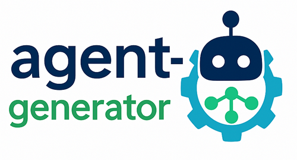

# agent-generator

*From one plain-English sentence to a production-ready multi-agent project.*



`agent-generator` converts natural language descriptions into complete, runnable
multi-agent projects for:

- **CrewAI** (Python + YAML config)
- **LangGraph** (StateGraph with typed state)
- **WatsonX Orchestrate** (ADK YAML)
- **CrewAI Flow** (event-driven pipelines)
- **ReAct** (reasoning + tool loop)

Choose your LLM provider:

- **IBM WatsonX** (default)
- **OpenAI** (via `--provider openai`)

---

## How It Works

1. **Describe** your agent team in plain English
2. **Plan** -- keyword pre-classifier + one LLM call produces a structured ProjectSpec
3. **Generate** -- Jinja2 templates render deterministic, reproducible code
4. **Validate** -- AST check, YAML parse, security scan, reference validation
5. **Package** -- Download as ZIP or write to file

The LLM is used **once** to produce a structured spec. Everything after that is deterministic.

---

## What You Get

| Framework | Files Generated |
|-----------|----------------|
| CrewAI (code+yaml) | `crew.py`, `main.py`, `agents.yaml`, `tasks.yaml`, tools, tests, `pyproject.toml`, README |
| LangGraph | `graph.py`, `main.py`, `nodes.py`, `requirements.txt`, README |
| WatsonX Orchestrate | `agent.yaml`, README |
| CrewAI Flow | Single Python file with Flow class |
| ReAct | Single Python file with reasoning loop |

---

## Features

| Feature | Description |
|---------|-------------|
| Multi-framework | 5 frameworks supported |
| Provider-agnostic | WatsonX (default) + OpenAI |
| Tool catalog | 6 built-in tool templates (web search, PDF, SQL, etc.) |
| MCP wrapper | FastAPI `/invoke` endpoint for any Python output |
| Web UI | Glassmorphism dark theme with file tree, code preview, ZIP download |
| Validation | Python AST, YAML schema, security scan, reference checks |
| CLI | Typer-based with dry-run, cost estimation, syntax highlighting |
| Extensible | Add providers/frameworks via one subclass |

---

## Quick Install

```bash
pip install agent-generator
```

For all extras:

```bash
pip install "agent-generator[all]"
```

---

**Next:** [Installation](installation.md) | [Usage](usage.md) | [Frameworks](frameworks.md) | [Architecture](architecture.md)
