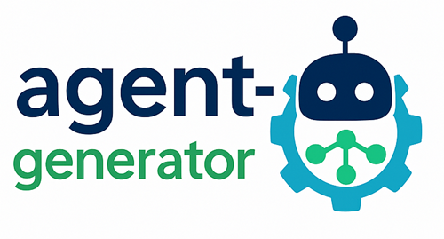

# 🛠️ agent‑generator 

*A one‑line prompt … a fully configured multi‑agent team, served via an MCP Gateway.*



`agent‑generator` converts plain‑English requirements into runnable code or YAML workflows for:

- **WatsonX Orchestrate** (YAML)  
- **CrewAI** & **CrewAI Flow**  
- **LangGraph**  
- **ReAct**  
- **BeeAI** (for backend orchestration)

You can choose your LLM provider:

- **IBM WatsonX** (default)  
- **OpenAI** (via `--provider openai` or `AGENTGEN_PROVIDER=openai`)

And you can run the multi‑agent planner & builder **in‑process** (no HTTP service) or point at a remote BeeAI backend:

```bash
export GENERATOR_BACKEND_URL=local      # in‑process mode
# or
export GENERATOR_BACKEND_URL=http://localhost:8000
````

---

## Why Multi‑Agent + MCP Gateway?

Splitting a complex task into specialized agents lets you:

* **Parallelize** subtasks (e.g. research, summarise, review)
* **Specialize** prompts per role for cleaner, maintainable code
* **Preview** your entire project tree before any code is written
* **Visualize** your workflow as Mermaid or DOT diagrams

The integration with an MCP server wrapper (FastAPI) and MCP Gateway provides:

* **Unified HTTP entrypoint** or in‑process API for all agents
* **Route isolation** per sub‑agent or toolkit
* **Built‑in monitoring**, health checks and cost endpoints

This makes your multi‑agent system production‑ready with minimal boilerplate.

---

## Highlights

| Feature                         | ✓ |
| ------------------------------- | - |
| IBM WatsonX *default*           | ✅ |
| OpenAI support                  | ✅ |
| Plug‑in providers               | ✅ |
| MCP server wrapper & Gateway    | ✅ |
| Rich CLI + Flask UI             | ✅ |
| Mermaid / DOT diagrams          | ✅ |
| Zero‑flag interactive wizard    | ✅ |
| BeeAI multi‑agent build backend | ✅ |

---

## 5 · User experience (wizard)

```text
$ agent-generator
🪄  Agent Generator • Guided mode

Describe what you’d like to build:
> A research assistant that can search and read internal PDFs and summarise them.

Choose target framework (default = watsonx_orchestrate):
  1) watsonx_orchestrate
  2) crewai
  3) langraph
  4) beeai
  5) react
Select [1-5]: 1

⏳  Contacting backend orchestrator …

📂  Proposed project structure:

  build/
    watsonx_orchestrate/
      agents/research_assistant.yaml
      tool_sources/pdf_summariser/…
      mcp_servers/
        docling_gateway/  (re-used)
  scripts/
    import-mcp-toolkits.sh
    publish-agent.sh

Generate this project? [Y/n]: y
🤖  Running multi-agent build …
✔  pdf_summariser scaffolded
✔  tests passed
✔  toolkits imported (idempotent)
✔  agent YAML written
🚀  Done. Created build/watsonx_orchestrate/
```

---

## 6 · Multi‑agent backend architecture (BeeAI)

```text
┌──────────────────────────┐          ┌───────────────────────┐
│      REQUEST ROUTER      │  plan    │   PLANNING AGENT      │
│  (FastAPI / beeai host)  │─────────►│ ("Architect")         │
└──────────────────────────┘          └────────┬──────────────┘
               ▲                               │build_tasks
               │ /build                        ▼
               │                    ┌───────────────────────────┐
               └────────────────────┤  BUILDER MANAGER AGENT    │
                                    └────────┬──────────────────┘
                                             │spawns
         ┌──────────────────────────┐        │
         │  PY_TOOL_BUILDER agent   │◄───────┘
         ├──────────────────────────┤
         │  MCP_TOOL_BUILDER agent  │◄─┐
         ├──────────────────────────┤  │
         │  YAML_AGENT_WRITER agent │◄─┤   (all run in parallel,
         └──────────────────────────┘  │    stream status back)
                                       │
                               ┌───────▼────────┐
                               │  MERGER AGENT  │
                               └────────┬───────┘
                                        ▼
                           writes to build/<framework>/…
```

* Every leaf builder focuses on **one file/folder** (single responsibility).
* **Merger Agent** assembles, deduplicates versions, writes the final tree.
* The orchestrator streams progress to the wizard (Rich spinner lines).
* The same plan can be executed again; idempotent checks are inside builders.

---

## 7 · Quick start

Jump in: **[Installation ➜](installation.md)** · **[Usage ➜](usage.md)** · **[Frameworks ➜](frameworks.md)**

